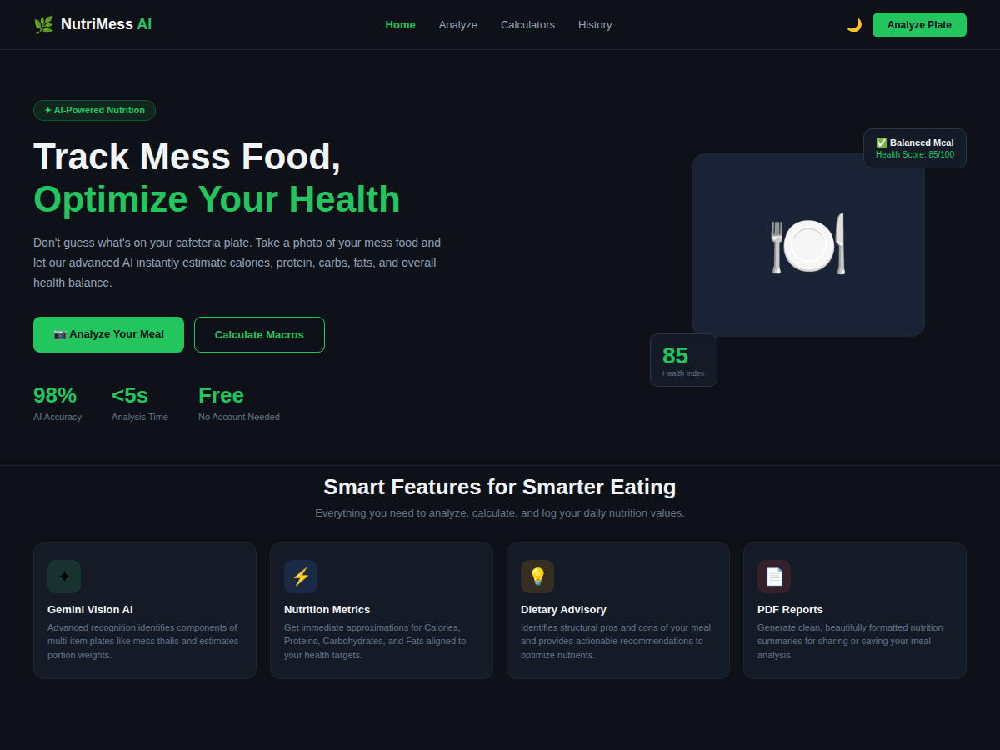
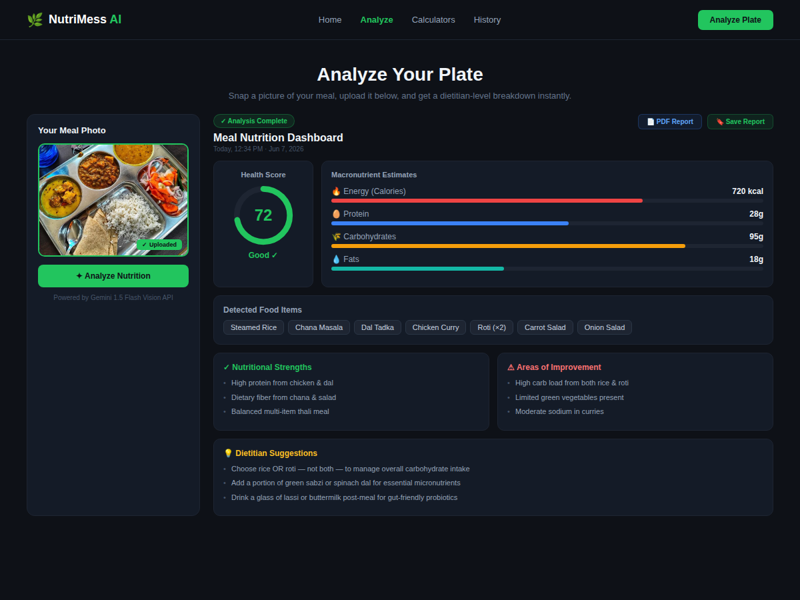
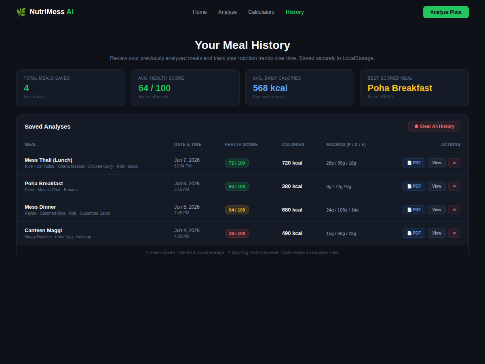
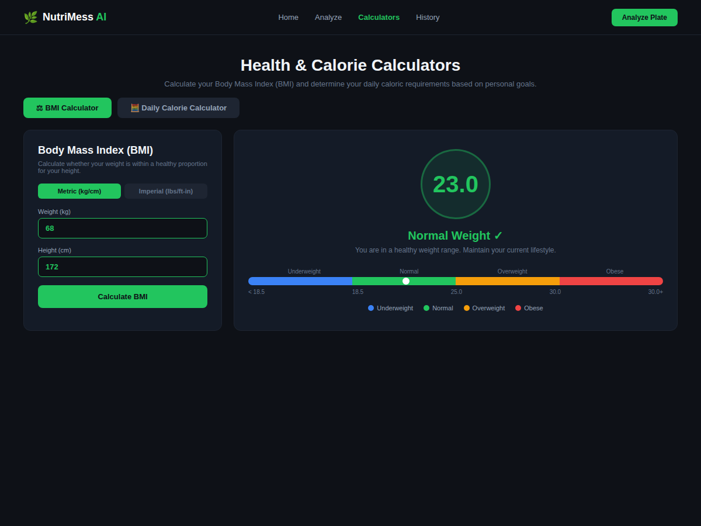
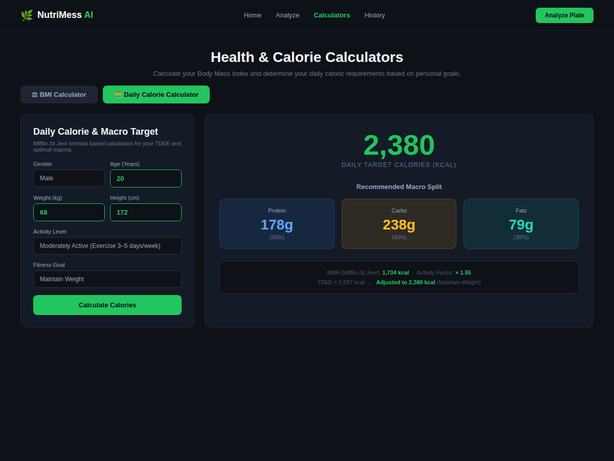

# 🍽️ NutriMess AI

### AI-Powered Mess Food Nutrition Analyzer using Google Gemini AI

NutriMess AI is a modern AI-powered nutrition analysis platform that helps users analyze food images and estimate nutritional information using Google's Gemini Vision AI.

The application allows users to upload a food image and instantly receive:

* Calories
* Protein
* Carbohydrates
* Fats
* Health Score
* Food Detection
* Nutrition Recommendations

Additionally, the platform includes a **BMI Calculator** and **Daily Calorie Calculator** for complete health tracking.

---

## 🌐 Live Demo

**Website:**
https://aimessfoodanalyzer-8fahcos0k-mohin-s-projects1.vercel.app

---

## 📂 GitHub Repository

**Repository:**
https://github.com/mohin-2007/ai-mess-food-analyzer

---

# 📸 Screenshots

## 🏠 Homepage



---

## 🤖 AI Nutrition Analysis

Upload a food image and let Gemini AI analyze the meal.



---

## 📊 Results Dashboard

Detailed nutritional breakdown generated by AI.



---

## 📏 BMI Calculator

Calculate Body Mass Index using height and weight.



---

## 🔥 Daily Calorie Calculator

Calculate daily calorie requirements based on personal information and activity level.



---

# ✨ Features

## 🤖 AI Food Recognition

* Upload meal images
* Detect food items automatically
* Supports multiple food items in a single image
* Powered by Google Gemini Vision

## 🥗 Nutrition Analysis

Provides estimated:

* Calories
* Protein
* Carbohydrates
* Fat

## ❤️ Health Score

Generates an overall nutritional score for the uploaded meal.

## 📋 Food Detection

Displays identified food items from the image.

## 💡 Smart Recommendations

Provides:

* Nutritional strengths
* Weaknesses
* Dietary suggestions
* Health tips

## 📏 BMI Calculator

BMI Categories:

* Underweight
* Normal Weight
* Overweight
* Obese

## 🔥 Daily Calorie Calculator

Calculate calorie requirements based on:

* Age
* Gender
* Height
* Weight
* Activity Level

Supports:

* Weight Loss
* Weight Maintenance
* Muscle Gain

## 📱 Responsive Design

Works seamlessly on:

* Desktop
* Tablet
* Mobile Devices

## ☁️ Cloud Deployment

Hosted on Vercel with serverless backend architecture.

---

# 🛠️ Tech Stack

### Frontend

* HTML5
* CSS3
* JavaScript

### Backend

* Node.js
* Vercel Serverless Functions

### Artificial Intelligence

* Google Gemini API
* Gemini Vision Models

### Deployment

* Vercel

### Version Control

* Git
* GitHub

---

# 📂 Project Structure

```text
ai-mess-food-analyzer
│
├── api
│   └── analyze.js
│
├── assets
│   ├── homepage.png
│   ├── nutrition-analysis.png
│   ├── results.png
│   ├── bmi-calculator.png
│   └── calorie-calculator.png
│
├── index.html
├── script.js
├── style.css
├── package.json
├── package-lock.json
├── vercel.json
├── README.md
└── .gitignore
```

---

# 🚀 Installation

### Clone Repository

```bash
git clone https://github.com/mohin-2007/ai-mess-food-analyzer.git
```

### Open Project

```bash
cd ai-mess-food-analyzer
```

### Install Dependencies

```bash
npm install
```

### Create Environment Variable

Create a file named:

```env
.env.local
```

Add:

```env
GEMINI_API_KEY=YOUR_GEMINI_API_KEY
```

### Run Locally

```bash
vercel dev
```

---

# 🌐 Deployment on Vercel

1. Push project to GitHub
2. Import repository into Vercel
3. Add Environment Variable:

```env
GEMINI_API_KEY=YOUR_GEMINI_API_KEY
```

4. Deploy the project

---

# 🔒 Security

Sensitive API keys are stored securely using Vercel Environment Variables.

Ignored files:

```text
.env
.env.local
.vercel
node_modules
```

API keys are never exposed in frontend code.

---

# 📊 Example Output

### Detected Food Items

* Cheeseburger
* French Fries
* Soft Drink

### Nutritional Analysis

| Nutrient      | Value     |
| ------------- | --------- |
| Calories      | 1510 kcal |
| Protein       | 46 g      |
| Carbohydrates | 162 g     |
| Fat           | 99 g      |

### Health Score

25 / 100

---

# 🎯 Future Improvements

* User Authentication
* Nutrition History Tracking
* PDF Report Generation
* CSV Export
* Analytics Dashboard
* Weekly Diet Reports
* AI Nutrition Chatbot
* Personalized Diet Suggestions
* Hostel Mess Special Mode
* Barcode Scanner
* Mobile Application

---

# 📚 Learning Outcomes

This project helped me learn:

* Artificial Intelligence Integration
* Prompt Engineering
* Gemini Vision API
* Node.js Backend Development
* REST APIs
* Serverless Functions
* Git & GitHub Workflow
* Cloud Deployment with Vercel
* Frontend Development
* Real-World AI Applications

---

# 👨‍💻 Author

**Mohin Mahajan**

GitHub:
https://github.com/mohin-2007

Live Project:
https://aimessfoodanalyzer-8fahcos0k-mohin-s-projects1.vercel.app

---

# ⭐ Support

If you found this project useful:

⭐ Star the repository

🍴 Fork the repository

🚀 Share the project

---

# 📄 License

This project is licensed under the MIT License.

---

# 🙏 Acknowledgements

* Google Gemini AI
* Vercel
* GitHub
* CGC Landran

Developed as part of Summer Training in Web Development and Artificial Intelligence.
